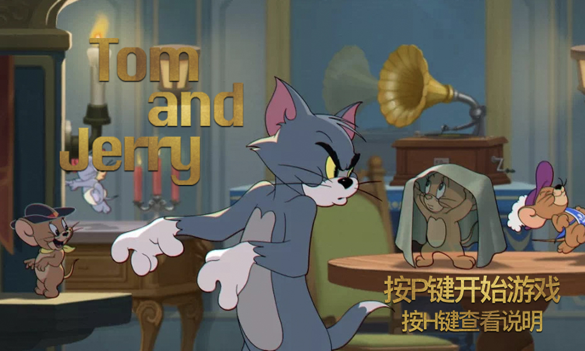
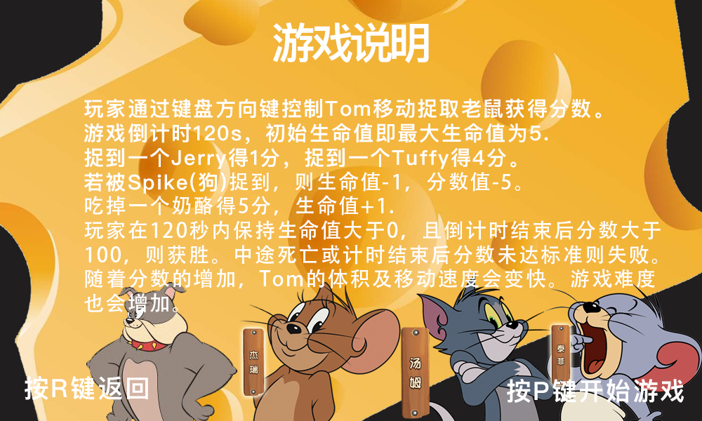
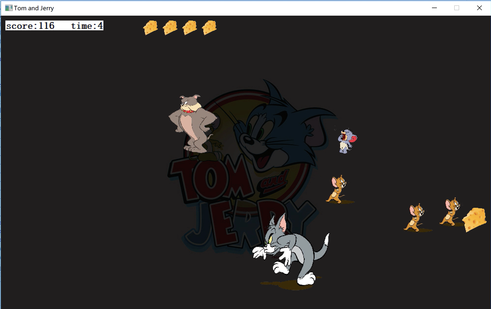
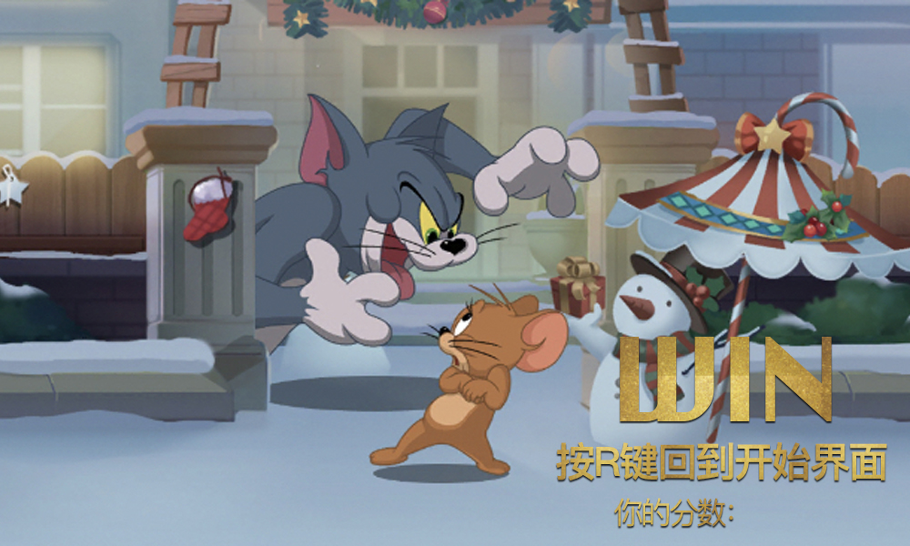
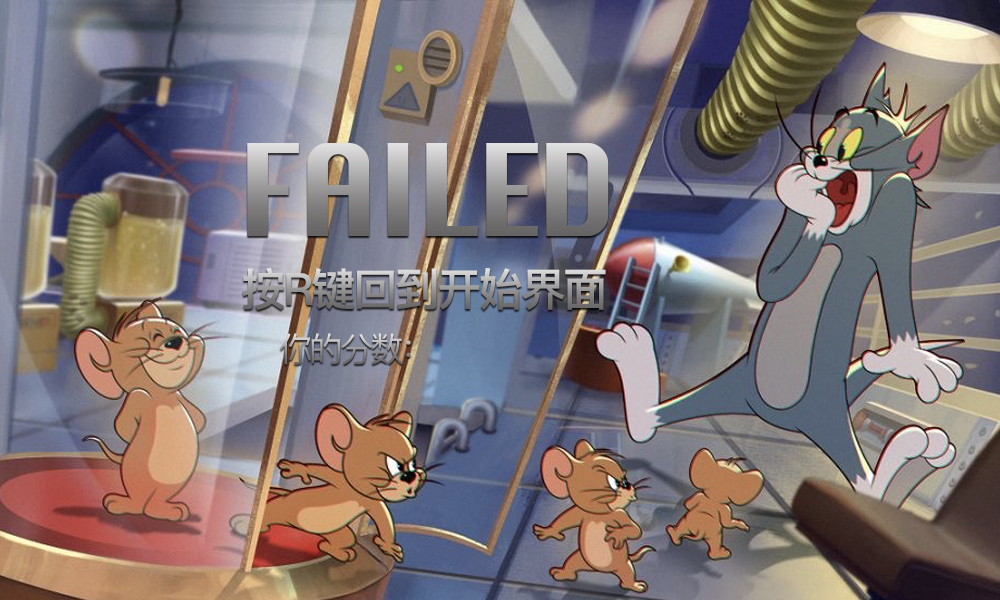

# 《Tom and Jerry》小游戏

- 根据mooc上电子科技大学《程序设计基础（C&C++）》课程的戴波老师在网课中示范讲解的部分代码改编完善而成。
- 利用适合C初学者的ACLLib库进行简单的图形界面的编写。[ACLLib说明及下载地址。](https://github.com/wengkai/ACLLib)
- 图片、音乐素材来源于网络。

## 软件界面演示
- 游戏开始界面

- 游戏说明界面

- 游戏界面

- 游戏获胜界面

- 游戏失败界面
